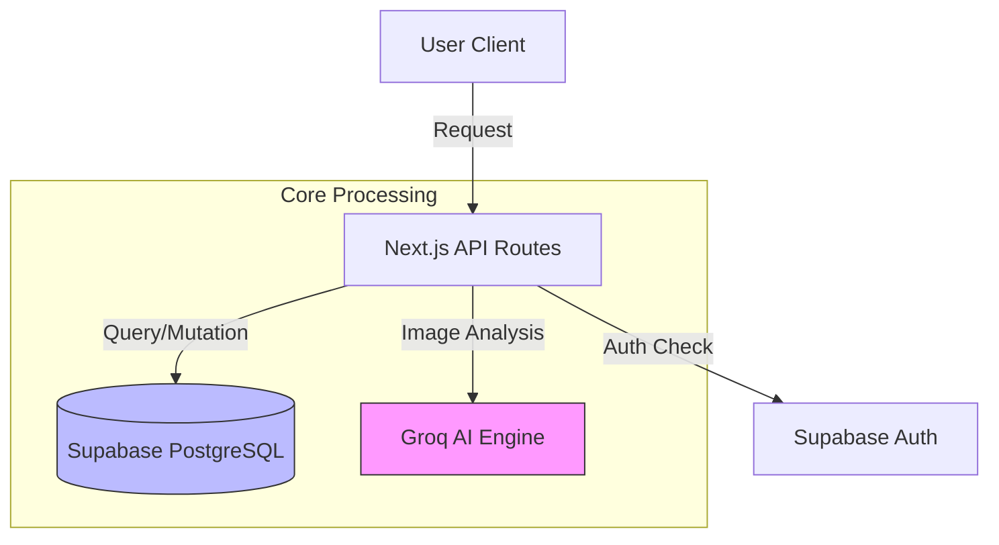

# Sikalori - Technical Documentation

**Dokumen**: System Architecture & Module Reference
**Versi Project**: 2.0 (Feb 2026)
**Peran**: Senior System Analyst

---

## 1. Project Overview

**Sikalori** (Sistem Informasi Kalori) adalah platform kesehatan digital berbasis web yang dirancang untuk membantu pengguna mencapai target kesehatan mereka (menurunkan, menaikkan, atau menjaga berat badan) melalui pendekatan berbasis data.

Sistem ini tidak hanya mencatat kalori, tetapi menggunakan **Artificial Intelligence (AI)** untuk menganalisis nutrisi makanan dari gambar atau teks, memberikan rekomendasi personal (personalization engine) berdasarkan profil medis pengguna, dan menyediakan dashboard analitik bagi administrator.

---

## 2. Tech Stack

Berikut adalah teknologi inti yang membangun ekosistem Sikalori:

| Komponen                    | Teknologi                   | Keterangan                                                            |
| :-------------------------- | :-------------------------- | :-------------------------------------------------------------------- |
| **Frontend Framework**      | **Next.js 16 (App Router)** | Rendering Server-Side (SSR) & Client-Side yang optimal.               |
| **Language**                | **TypeScript**              | Type-safety untuk meminimalisir bug saat development.                 |
| **Styling**                 | **Tailwind CSS**            | Design system dengan pendekatan utility-first (Desain Neo-Brutalism). |
| **Backend / Database**      | **Supabase (PostgreSQL)**   | Database relasional, Auth, dan Realtime subscriptions.                |
| **Artificial Intelligence** | **Groq SDK (Llama 3/4)**    | Engine analisis visual & teks untuk pengenalan makanan super cepat.   |
| **Payment Gateway**         | **Midtrans (Snap)**         | Proses pembayaran langganan Premium otomatis.                         |
| **State Management**        | **React Hooks**             | Manajemen state lokal dan global yang ringan.                         |

---

## 3. Modul-Modul Utama

### A. Modul Autentikasi

Bertanggung jawab atas keamanan akses dan identitas pengguna.

- **Teknologi**: Supabase Auth (Email & Password).
- **Fitur Utama**:
  - **Secure Login/Register**: Validasi email dan password terenkripsi.
  - **Role-Based Access Control (RBAC)**: Membedakan akses antara `User` regular dan `Admin` dashboard.
  - **Session Management**: Menggunakan HTTP-only cookies melalui `@supabase/ssr` untuk persistensi sesi yang aman di sisi server dan client.
  - **Middleware Protection**: `src/middleware.ts` memverifikasi token pada setiap request halaman sensitif (dashboard, profile).

### B. Modul Kalkulator Nutrisi (Health Engine)

Otak kesehatan dari aplikasi yang menghitung metrik vital tubuh.

- **Lokasi Code**: `src/lib/health-calculations.ts`
- **Metode Perhitungan**:
  1.  **BMI (Body Mass Index)**: Indikator awal status berat badan.
  2.  **BMR (Basal Metabolic Rate)**: Menggunakan rumus **Mifflin-St Jeor** (standar medis modern) untuk menghitung kebutuhan kalori dasar saat istirahat.
  3.  **TDEE (Total Daily Energy Expenditure)**: Mengalikan BMR dengan faktor aktivitas fisik (1.2 - 1.9).
  4.  **Calorie Targeting**:
      - _Weight Loss_: TDEE - 500 kkal.
      - _Bulking_: TDEE + 500 kkal.
      - _Maintenance_: TDEE.

### C. Modul Tracker & Log Harian

Sistem pencatatan dan visualisasi progres pengguna.

- **Alur Kerja**:
  1.  User menginput makanan (via Text atau Scan Gambar).
  2.  Sistem menyimpan data ke tabel `food_logs`.
  3.  Dashboard User menampilkan ringkasan harian (Total Kalori vs Target).
  4.  **Limitasi**: User _Free Tier_ dibatasi maksimal 10 scan/hari (validasi di sisi server).
- **Data Point**: Nama makanan, Kalori, Protein, Karbohidrat, Lemak, Waktu Makan.

### D. Modul Database Makanan (AI-Powered)

Berbeda dengan database statis konvensional, modul ini menggunakan Generative AI untuk mengenali makanan secara dinamis.

- **Endpoint**: `/api/analyze-food`
- **Cara Kerja**:
  1.  **Input**: Menerima Gambar (Binary) atau Teks deskripsi.
  2.  **Prompt Engineering**: Sistem membangun instruksi khusus (`src/lib/ai-prompt-builder.ts`) berdasarkan profil user (misal: "User sedang diet keto, beri saran rendah karbo").
  3.  **Processing**: Mengirim request ke LLM (Llama via Groq) untuk visi komputer dan analisis nutrisi.
  4.  **Output**: JSON terstruktur berisi nutrisi dan skor kesehatan (Health Score 1-10).
  5.  **Keunggulan**: Dapat mengenali masakan lokal spesifik (misal: "Nasi Padang dengan kuah gulai banyak") yang sering tidak akurat di database statis.

---

## 4. Arsitektur Data

Alur data dalam sistem Sikalori mengikuti pola _Server Check - Database Action - Client Update_.



1.  **Client-Side**: React components merender UI dan mengirim state lokal.
2.  **API Layer**: Memvalidasi input dan sesi user.
3.  **Supabase**: Menyimpan data relasional (Users <-> FoodLogs <-> PremiumSubscriptions).
4.  **AI Service**: Stateless processing untuk analisis makanan.

---

## 5. Panduan Instalasi Singkat

Untuk menjalankan proyek ini di lingkungan lokal (Development):

**Prasyarat**: Node.js (v18+), NPM, dan akun Supabase & Groq.

1.  **Clone Repository**

    ```bash
    git clone https://github.com/username/sikalori.git
    cd sikalori
    ```

2.  **Install Dependencies**

    ```bash
    npm install
    ```

3.  **Konfigurasi Environment**
    Buat file `.env.local` dan isi kredensial:

    ```env
    NEXT_PUBLIC_SUPABASE_URL=your_url
    NEXT_PUBLIC_SUPABASE_ANON_KEY=your_key
    GROQ_API_KEY=your_groq_key
    ```

4.  **Jalankan Server**
    ```bash
    npm run dev
    ```
    Buka `http://localhost:3000` di browser.

---